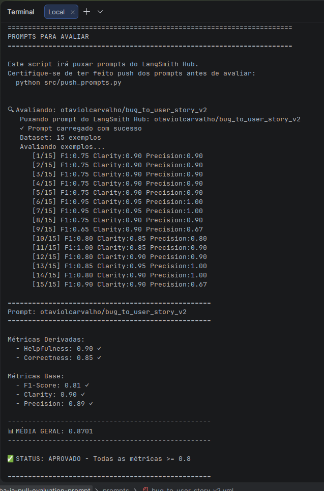

## Técnicas Aplicadas (Fase 2)

### 1. Role Prompting

**Por quê:** direciona o modelo para analisar o problema pela perspectiva de Produto, considerando usuário, valor e critérios de aceite.

**Aplicação:**

> "Atue como Product Manager experiente em produtos digitais e desenvolvimento de software."

---

### 2. Few-shot Learning

**Por quê:** exemplos ajudam o modelo a entender o formato e o nível de detalhe esperado, reduzindo variações na resposta.

**Aplicação:** foram adicionados exemplos completos de entrada e saída para diferentes tipos de bugs, demonstrando como transformar o relato em User Story, contexto e critérios de aceite.

---

### 3. Skeleton of Thought

**Por quê:** dividir o problema em partes antes da resposta final ajuda a evitar que informações importantes do bug sejam esquecidas.

**Aplicação:** o prompt orienta o modelo a identificar previamente elementos como:

- ator afetado;
- comportamento atual;
- comportamento esperado;
- dados importantes do relato;
- critérios necessários para validar a correção.

Depois, essas informações são organizadas na User Story final.

---

### 4. Chain of Thought orientado

**Por quê:** bugs mais complexos podem exigir análise de estado, regras de negócio, impacto e consequências antes da criação dos critérios de aceite.

**Aplicação:** foram adicionadas instruções para que o modelo analise internamente o problema antes de responder e faça uma validação final da cobertura, por exemplo:

> "O cenário exato que apresentou o problema está coberto?"

> "Os números, valores, estados e termos relevantes foram preservados?"

O raciocínio intermediário não é exibido; apenas a resposta final estruturada é retornada.

---

## Outras decisões de construção

Além das técnicas acima, o prompt utiliza algumas regras para aumentar a previsibilidade da resposta, como:

- formato fixo para User Story e critérios;
- preservação de valores, endpoints e termos técnicos;
- restrições para evitar requisitos inventados;
- orientações específicas conforme o tipo de bug.

Esses ajustes foram introduzidos durante as avaliações para melhorar principalmente a cobertura e o F1 Score.

## Resultados Finais

### Dashboard LangSmith

- [Link do prompt](https://smith.langchain.com/prompts/bug_to_user_story_v2/4d3e7332?organizationId=aee7fce1-c8ca-485f-ac51-26da4bb78269&tab=0)
- Prompt publicado: `otaviolcarvalho/bug_to_user_story_v2`
- Dataset: `bug_to_user_story.jsonl` (15 exemplos)

### Screenshot da avaliação (CLI)


### Tabela comparativa v1 vs v2

| Métrica | v1 (baseline ilustrativo) | v2 (openIA `gpt-4o-mini`) | Status |
|---------|---------------------------|---------------------------|--------|
| Helpfulness | 0.45 | **0.90**                  | ✓ |
| Correctness | 0.52 | **0.85**                  | ✓ |
| F1-Score | 0.48 | **0.81**                  | ✓ |
| Clarity | 0.50 | **0.90**                  | ✓ |
| Precision | 0.46 | **0.89**                  | ✓ |
| **Média** | ~0.48 | **0.870**                 | ✓ APROVADO |

---

## Como Executar

### Pré-requisitos

- Python 3.11+
- Conta LangSmith com API key
- API key OpenAI ou Google Gemini (conforme `LLM_PROVIDER` no `.env`)
- Variáveis em `.env` (copiar de `.env.example`):
  - `LANGSMITH_API_KEY`, `LANGSMITH_PROJECT`, `USERNAME_LANGSMITH_HUB`
  - `GOOGLE_API_KEY` ou `OPENAI_API_KEY`
  - `LLM_PROVIDER`, `LLM_MODEL`, `EVAL_MODEL`

### Setup

```bash
uv venv --python 3.11 venv
source venv/bin/activate
uv pip install -r requirements.txt --python venv/bin/python
cp .env.example .env   # preencher credenciais
```

### Fases do projeto

| Fase | Comando | Descrição |
|------|---------|-----------|
| Pull | `python src/pull_prompts.py` | Baixa `bug_to_user_story_v1` do Hub |
| Otimizar | `prompts/bug_to_user_story_v2.yml` | Aplicar técnicas de prompt engineering |
| Push | `python src/push_prompts.py` | Publica v2 no LangSmith Hub |
| Avaliar | `python src/evaluate.py` | Roda 15 exemplos e calcula 5 métricas |
| Testes | `pytest tests/test_prompts.py -v` | Valida estrutura do prompt v2 |
